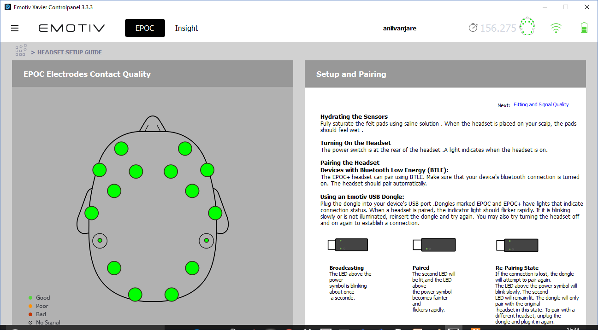
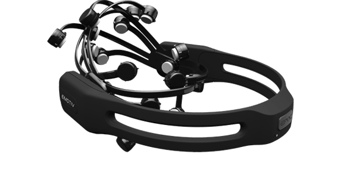

# Brain Computer Interface (BCI)
### Objective 
To control a mini multi-rotor UAV through Brain Computer Interface(BCI). UAVs are controlled manually by a remote control. The BCI process involves the cognitive thoughts of the pilot on the transmitter to maneuver the UAV. Through BCI, it is possible to direct the UAV through thoughts without intermediary physical actions.
***
### Tech

This Project uses a number of open source and closed source sub-modules to work properly:

* **MATLAB R2016** - Research Development Software by MathWorks
* **Node.js** - Evented I/O for the backend
* **Xavier Control Panel** - EMOTIV Software for data acquisition
* **OpenVibe Acquisition Panel** - Open source software for raw data acquisition
***


### Installation

* Install MATLAB
* Install npm (Node installer package like pip for python)
* Install Node.js via npm (or from the [website](https://nodejs.org/en/))
* Install ar-drone JavaScript Library via npm
* Install Xavier Control Panel [here](https://drive.google.com/drive/folders/14w7MrvZJy8Cn7_gXhZbSCtEljkP86xLF?usp=sharing)

```sh
$ npm install nodejs
$ npm install ar-drone
```
***
### Setup
Once all the libraries are installed, connect your EMOTIV EPOC+ headset to the Xavier Control Panel and make sure all the signal connections are green. 

Once this is done, configure OpenVibe-LSL linkage to access the raw data from the EPOC+ headset. An easier way is to use EmoKey Software associated with the Control Panel and associate key-press events with pushing/pulling of the virtual box.

Once the training of the user is done and the EmoKey is configured, run the **keypress.js** by chaning into that directory. 
```sh
$ cd C:\Users\{username}\Downloads
$ node keypress.js
```
Also you can run the **flydrone.js** for 5 different commands of navigation
```sh
$ cd C:\Users\{username}\Downloads
$ node flydrone.js
```
**Make sure the libraries for ar-drone and nodejs are installed and configured properly.**
### Team

* **Priya Rao** <einzig.piya01@gmail.com>
* **Ankita Verma** <ankitavermaom1995@gmail.com>
* **Likith Reddy** <likith012@gmail.com>
* **Akshay Khokhar** <khokharakshay42@gmail.com>

### Maintainer
* **Saumya Kumaar Saksena** <kumaar324@gmail.com>

Click on the image below for a demonstration.

[](https://www.youtube.com/watch?v=zt1AdiktwXs)
